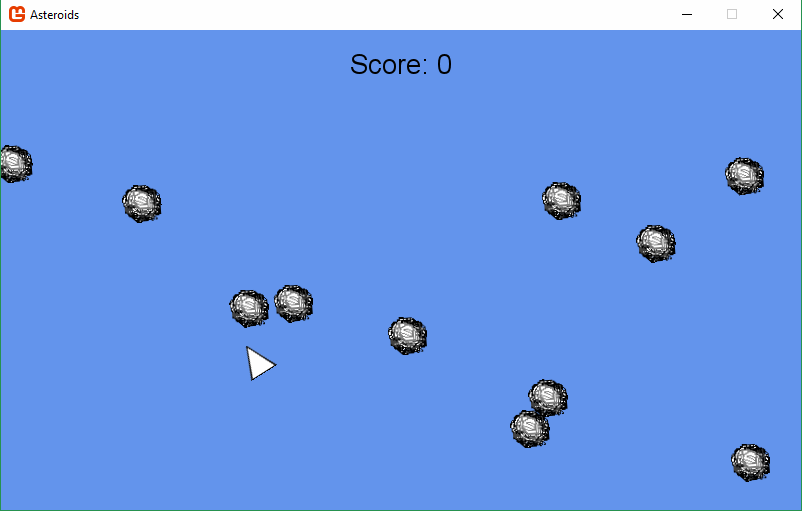

# Mono-Asteroids

Asteroids implemented with Monogame and C#.

## Getting Started

Playing this implementation of Asteroids will require you to build a
working copy. The only dependency required for this application is
Monogame, which you can download from
[NuGet](https://www.nuget.org/packages/MonoGame.Framework.WindowsDX/).

Upon building the application the game should run, as the assets used
are also contained in this GitHub repository.

## How to Play

Use W, A, and D to control the ship. W will propel the ship forward, A
and D will rotate it left and right respectively.

Press Space to fire the ship's missiles. Missiles will recharge after
hitting an asteroid or after reaching the end of the screen.